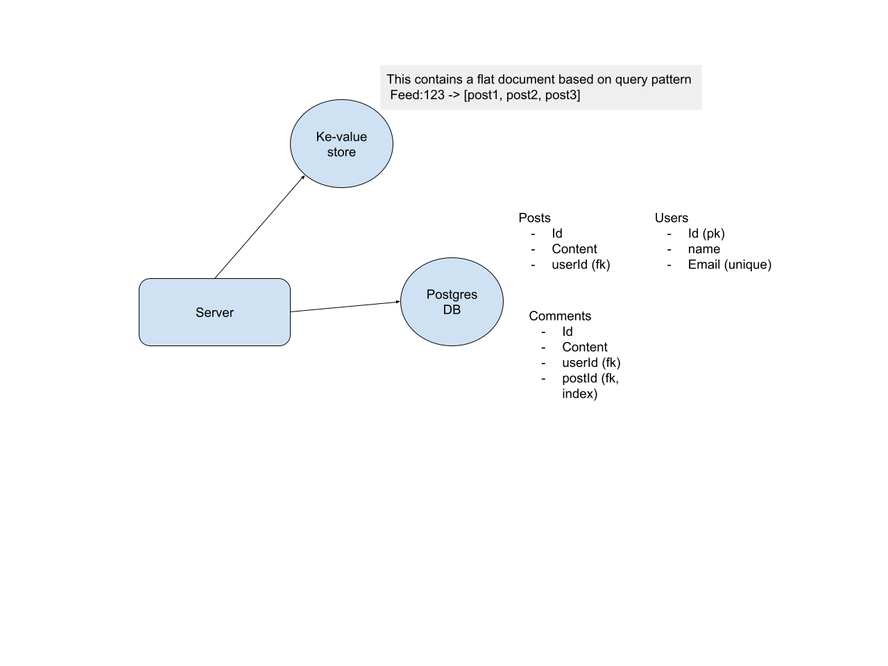

+++
date = '2026-06-14T05:45:05-07:00'
draft = false
title = 'Databases High Level'
+++

# Databases



## Types of Databases

### Relational (Default)
Relational databases are the default choice for most applications.

**User Table**
| Id | name | email |
|---|---|---|
| 1 | john | john@email.com |

**Posts Table**
| id | userId (FK) | content |
|---|---|---|
| 1 | 1 | "Hello world" |

**Likes Table**
| id | postId (FK) | userID |
|---|---|---|
| 1 | 1 | 1 |

### Document DB
Notice how the data is de-normalized, however it is not mandatory to de-normalize as modern Document DBs support JOIN unlike traditional Databases.
If you need flexibility for evolving schema then Document DB is better, however in system-design it is better to narrow-down on the functionality so you have a good-idea of schema, so go with RDB.
Not necessarily needs “De normalized” data, but traditionally document DB are not great at JOINs, hence you default to storing “De normalized” data.

**John**
```json
{
  "_id": "asdfdsafasdfass",
  "Name": "john",
  "Posts": {
    "Content": "Hello, world"
  }    
}
```

**Jane**
```json
{
  "_id": "asdfjkljl;asdfads",
  "name" : "jane",
  "Posts": {
    "Content": "hello world from Jane"
  }
}
```

### Key-Value DB
Examples: Redis and DynamoDB (DynamoDB is both key-value and Document DB).

### Wide-column DB
Each row can have completely different columns. These are great for Write-heavy as it is append-only instead of updating some existing item.
Used for Time-series DB, event-logging, Iot-sensors logs.
Think of it as a nested multi-dimensional key-value store.

### Graph
Steer-away in interviews, even in FB they dont use this for social-networks, Even FB models social-graph using SQL DB only.

## Schema Design
Ground you decisions based on following 3 principles:
* **Data Volume**: How big is Data, do i need multiple DBs or single would suffice?
* **Access Pattern**: How is data queried: Drives indexes and structure
* **Consistency Requirements**: How strict? ACID vs eventual consistency

### Entities, Key & Relationships
* **Primary Key (PK)** - Unique identifier for each record in a table
* **Foreign Key (FK)** - Points to a primary key in another table to create relationships. Referential integrity: Example Post cannot exist if the user is not there for it.

### Enforce Constraints at DB level
* Columns are not NULL
* Unique with in table

### Denormalize
Only do this when there is a deliberate need to improve Read performance.

### Indexing
Ask yourself what query the use-case needs to run then add indexes for the "Where", Order_By columns.
* B-tree: log(n)
* Add index for most "where" clauses
* Add index for "sort" columns

## Scaling and Sharding

Shard by primary access pattern. Avoid cross-join sharding by keeping related data together. If Posts is sharded by postID, shard Comments also by postID not commentID.

### Range based sharding
Leads to un-even distribution, in the beginning only Shard1 will be busy as mono-tonically increasing user_ids. Hence Industry default is Hash based sharding.

### Hash based sharding
Instead of directly using user_id, compute the Hash of user_id and then determine Shard by applying modulo.
The issue is if a new DB shard gets added then almost everything needs to be re-shuffled as mod3 and mod4 results in a different Shard number for almost everything (except numbers divisible by both 3,4), and this is expensive. So use Consistent hashing where all the Hash keys are distributed on a circle and nodes are also evenly distributed on the Circle, when a new node gets added all the nodes shift a little causing only few data shifts rather than everything. Consistent hashing has a concept of VIrtual Nodes to minimize this shift even further.

### Directory-based sharding
Instead of using a formula to decide where data lives, use a look up table. This is very flexible but creates a extra latency and single point of failure because of where the directory is being maintained.